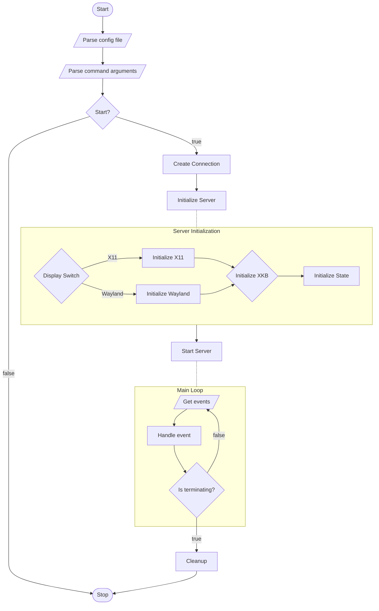

# Docs
The flow of the whole program. To not be confused about the main responsibility of an object or the initialization time of a singleton.

# Flow Chart

```mermaid
flowchart TD
    S1([Start])
    S2([Stop])
    PC[/Parse config file/]
    PA[/Parse command arguments/]
    CC[Create Connection]
    IS[Initialize Server]
    SS[Start Server]
    ST{Start?}
    GE[/Get events/]
    HE[Handle event]
    IT{Is terminating?}
    CU[Cleanup]
    S1 --> PC
    PC --> PA
    PA --> ST
    ST --> |true| CC
    ST --> |false| S2
    CC --> IS
    IS -.- SI --> SS
    SS -.- ML
    IT --> |true| CU
    CU --> S2
    subgraph SI [Server Initialization]
        direction LR
        DS{Display Switch} --> |X11| IX
        DS{Display Switch} --> |Wayland| IW
        IXKB{Initialize XKB}
        IX[Initialize X11] --> IXKB
        IW[Initialize Wayland] --> IXKB
        IXKB --> IST[Initialize State]
    end
    subgraph ML [Main Loop]
        direction LR
        IT --> |false| GE
        GE --> HE
        HE --> IT
    end
```